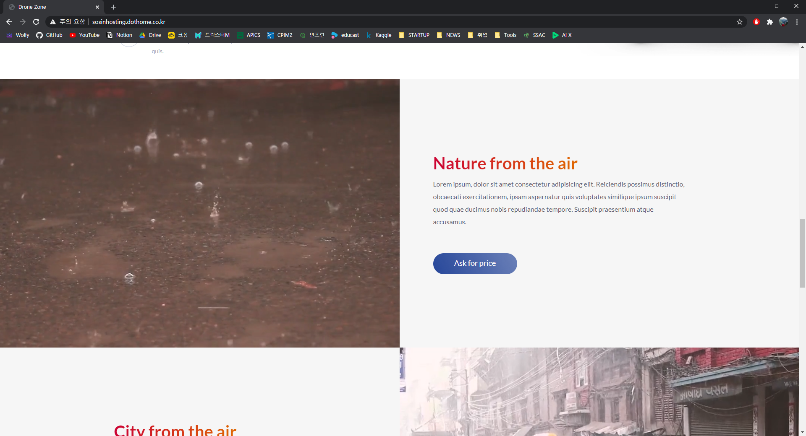

# [SSAC] Front-end Study & Sample Proejct

**2020 SSAC 1기 Front-end HTML, CSS, JS, jQuery & Sample Project**

------

#### SSAC Front-end 교육 개요

Web 개발을 위한 Front-end HTML, CSS, Javascript, jQuery의 기본 사용방법과 Responsive Web 구현 방법, 실무적 활용능력을 배양하고 디자인 샘플을 통해 직접 반응형 웹 구축

> [Sample Project Drone Zone](http://sosinhosting.dothome.co.kr/)

#### Drone Zone 페이지 구현 결과

※ Footer는 제외함

> Reference
>
> 1. [강의 자료 Github](https://github.com/ministori-yonsei/ssac-tutorial)

